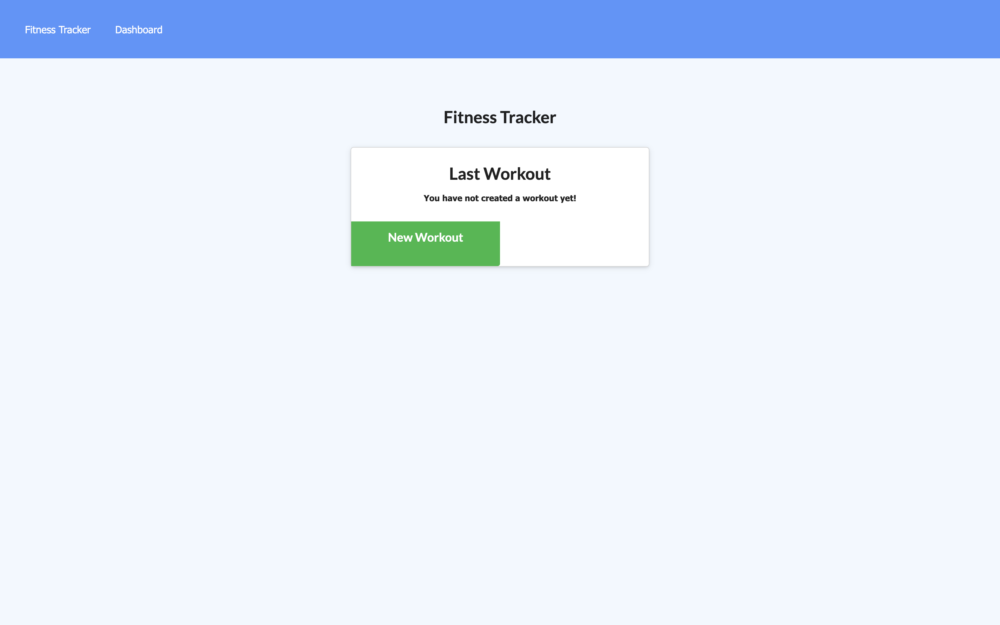
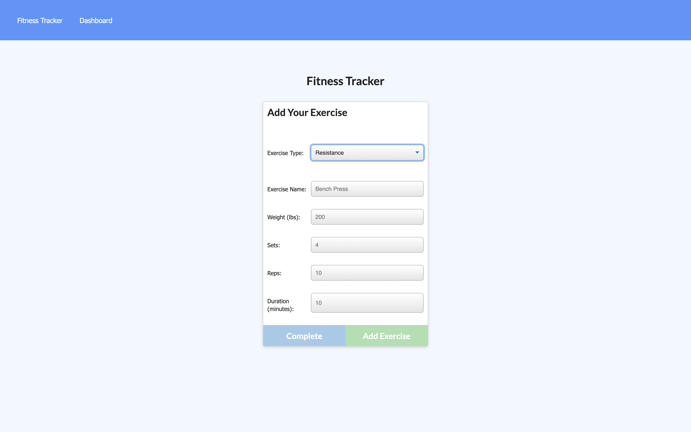

# Workout Tracker

  
  
  

  ## Description 
In this app you'll be able to view, create and track daily workouts. You'll also be able to log multiple exercises in a workout on a given day and track the name, type, weight, sets, reps, and duration of exercise.

  
  

  ## Table of Contents
  
  * [Links](#Links)
  * [Installation](#installation)
  * [Usage](#usage)
  * [License](#license) 
  * [Contributing](#contributing)
  * [Questions](#questions) 

  ## Links

  Visit the deployed application [here](https://boiling-everglades-06609.herokuapp.com/)
  
  ## Installation
  1. Clone or download the repository
  1. Open console
  1. Run `npm install` to install dependencies
  
  ## Usage
    Write `npm run start` or `npm start` in console to start the application
  
## License
This application is covered under MIT License [More information about about the license](https://choosealicense.com/licenses/mit/)
  
  ## Contributing
  Please feel free to contribute by sending a pull request

  ## Questions
  Please feel free to reach out with any questions via [email](mailto:samersaemeldahr@gmail.com) or [GitHub](https://www.github.com/samersaemeldahr)